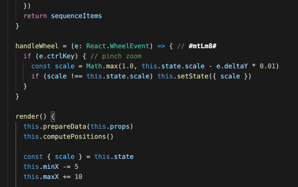

# CodeStory  README

This VSCode extension provides CodeStory integration.

* Token highlighting,
* Command-click on tokens to view in CodeStory.

## Features

Describe specific features of your extension including screenshots of your extension in action. Image paths are relative to this README file.

For example if there is an image subfolder under your extension project workspace:



## Requirements

Works with CodeStory.

You also need to:
- activate Semantic Highlighting in your VSCode settings.
  
- Add a `codestory` rule in `settings.json` > `editor.semanticTokenColorCustomizations`   
    ```
        "editor.semanticTokenColorCustomizations": {
            "enabled": true,
            "rules": {
                "codestory": {
                    "foreground": "#FFFFFF",
                    "bold": true
                }
            },
        }
    ```
    

## Extension Settings

This extension contributes the following settings:

* `codestory.installPath`: path to the CodeStory binary

## Release Notes


### 0.1.0

Initial release.
